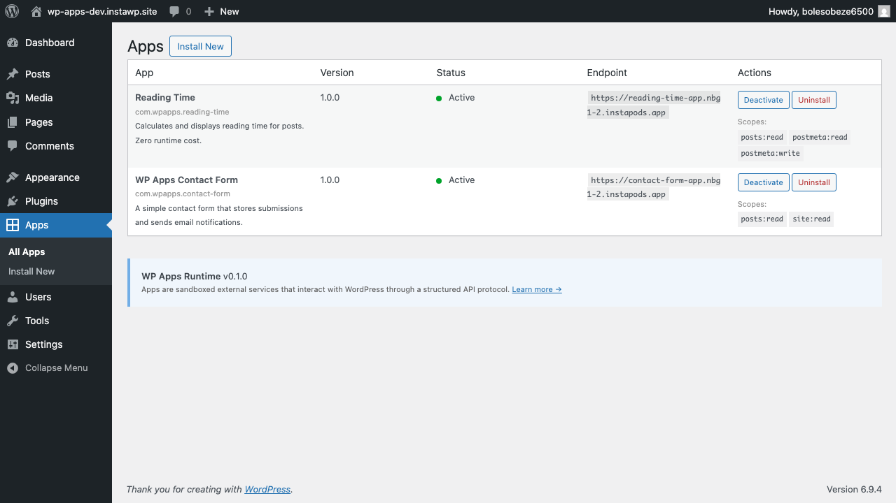

# WP Apps

**Sandboxed, permission-scoped extensions for WordPress.**

Apps run as isolated external HTTP services — zero access to your database, filesystem, or PHP runtime. The Shopify model, for WordPress.

https://github.com/user-attachments/assets/wp-apps-demo.mp4

<video src="docs/wp-apps-demo.mp4" controls width="100%"></video>

> If it's a service, it's an app. If it's infrastructure, it's a plugin.

## Why

WordPress plugins execute as trusted code inside the PHP runtime. A plugin has full access to the database, filesystem, network, and every other plugin. Plugin vulnerabilities are the #1 attack vector for WordPress sites.

WP Apps fixes this by running extensions as **external services** that communicate through a structured API protocol — with scoped OAuth tokens, granular permissions, and full audit logging.

## How It Works

```
WordPress Site                          App Server
┌──────────────────────┐                ┌──────────────┐
│  Apps Runtime         │   HTTPS/API   │  Your App    │
│  ├─ API Gateway      │◄─────────────►│  ├─ Events   │
│  ├─ Block Manager    │               │  ├─ Blocks   │
│  ├─ Event Webhooks   │               │  └─ Own DB   │
│  ├─ Meta Renderer    │               └──────────────┘
│  └─ Permission       │
│     Enforcement      │
└──────────────────────┘
```

**Data-first:** Apps write data via API, WordPress renders it. Zero HTTP calls during page loads.

**Two-tier integration:**
- **Tier 1 (preferred):** Event webhooks + blocks + post meta = zero runtime cost
- **Tier 2 (escape hatch):** Render-path filters like `the_content` = adds latency, discouraged

## Quick Start

**1. Install the runtime** on your WordPress site ([download zip](https://github.com/InstaWP/wp-apps/releases))

**2. Create an app** with the PHP SDK:

```php
use WPApps\SDK\App;
use WPApps\SDK\Request;
use WPApps\SDK\Response;

$app = new App(__DIR__ . '/wp-app.json');

// Event: runs async when a post is saved (zero page-load cost)
$app->onEvent('save_post', function (Request $req): Response {
    $post = $req->api->get("/apps/v1/posts/{$req->args[0]}");
    $wordCount = str_word_count(strip_tags($post['content']['rendered']));
    $req->api->put("/apps/v1/posts/{$req->args[0]}/meta/reading_time", [
        'value' => max(1, (int) ceil($wordCount / 238))
    ]);
    return Response::ok();
});

// Block: cached HTML, served from WP cache on every page load
$app->onBlock('my-app/reading-time', function (Request $req): Response {
    return Response::block('<span>5 min read</span>');
});

$app->run();
```

**3. Deploy anywhere** that serves HTTP — cloud, container, serverless, or same server.

**4. Install via WP Admin** → Apps → Install New → enter your app's manifest URL.

## Example Apps

| App | What it demonstrates | Lines |
|-----|---------------------|-------|
| [Reading Time](sdk/examples/reading-time/) | Event → post meta → block (the complete data-first loop) | ~50 |
| [Contact Form](sdk/examples/contact-form/) | Block + form submission + app-side storage + admin panel | ~150 |
| [Hello App](sdk/example/) | `the_content` filter (Tier 2 escape hatch — legacy pattern) | ~30 |



## What Apps Can't Do

Apps **cannot** access:
- Database directly (SQL, $wpdb)
- Filesystem (wp-config.php, core files, uploads)
- PHP runtime (eval, globals, other plugins)
- User passwords or session tokens
- wp_options or transients (apps use their own storage)
- Other apps' data

## Documentation

- [Getting Started](docs/getting-started.md)
- [Manifest Reference](docs/manifest-reference.md) (`wp-app.json`)
- [SDK Reference](docs/sdk-reference.md) (PHP)
- [API Reference](docs/api-reference.md) (`/apps/v1/`)
- [Integration Model](docs/integration-model.md) (Tier 1 vs Tier 2)
- [Security](docs/security.md) (OAuth, HMAC, permissions)
- [Apps vs Plugins](docs/apps-vs-plugins.md) (when to build which)
- [Specification](SPEC.md) (full spec)

## Links

- **Website:** [wp-apps.org](https://wp-apps.org)
- **Spec:** [SPEC.md](SPEC.md)
- **Release:** [v0.0.1](https://github.com/InstaWP/wp-apps/releases/tag/v0.0.1)
- **License:** MIT

Created by [InstaWP](https://instawp.com)
