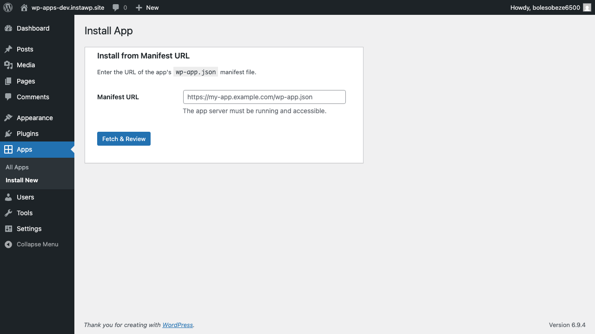

# WP Apps — Example Apps

Three example apps that demonstrate different integration patterns. Each is a complete, working app you can deploy and install on any WordPress site running the WP Apps Runtime.

## Contact Form

A contact form app with submissions management. Demonstrates blocks, app-side storage, and admin surfaces.

**Patterns used:** Block (cached) + form submission to app endpoint + app-side JSON storage + admin iframe


**How it works:**
1. App registers a `wpapps/contact-form` block (+ `[wpapps-contact-form]` shortcode fallback)
2. Admin places the block on a page via the block editor (or shortcode in Elementor/Divi)
3. Block HTML is rendered once by the app and cached — zero app calls on subsequent page loads
4. Form submissions POST directly to the app's `/submit` endpoint
5. App stores submissions in its own database (JSON file)
6. Admin views submissions at the app's `/admin` endpoint

**Files:**
- [`contact-form/wp-app.json`](contact-form/wp-app.json) — Manifest
- [`contact-form/index.php`](contact-form/index.php) — App logic (~150 lines)

**Deploy:**
```bash
instapods deploy contact-form-app --local ../sdk --preset php
```

---

## Reading Time

The simplest possible WP App. Calculates and displays reading time for posts in ~50 lines. Demonstrates the complete data-first loop.

**Patterns used:** Event webhook (async) + post meta + block (cached)

**How it works:**
1. Event: `save_post` fires → app calculates word count and reading time
2. App writes `reading_time` and `word_count` to post meta via API
3. Block: displays a "X min read" badge, cached for 24 hours
4. Zero page-load cost — data is pre-computed at save time, block is cached

**Files:**
- [`reading-time/wp-app.json`](reading-time/wp-app.json) — Manifest
- [`reading-time/index.php`](reading-time/index.php) — App logic (~50 lines of actual code)

**Deploy:**
```bash
instapods deploy reading-time-app --local ../sdk --preset php
```

---

## Hello App

A minimal demo that appends a greeting to post content. Uses a `the_content` filter (Tier 2 — escape hatch pattern, not recommended for new apps).

**Patterns used:** `the_content` filter (Tier 2 — discouraged, prefer blocks)

**Files:**
- [`../example/wp-app.json`](../example/wp-app.json) — Manifest
- [`../example/index.php`](../example/index.php) — App logic

> **Note:** This app exists for backwards compatibility testing. New apps should use blocks and event webhooks instead of content filters. See Reading Time and Contact Form for the recommended patterns.

---

## WP Admin — Apps Management

The runtime adds an **Apps** menu to the WordPress admin sidebar where you can install, activate, deactivate, and uninstall apps.




---

## Integration Patterns Summary

| Pattern | Page-load cost | When to use | Example app |
|---------|:---:|---|---|
| Event webhook → post meta | Zero | React to content changes | Reading Time |
| Block (cached) | Zero after first render | Frontend UI components | Contact Form, Reading Time |
| Shortcode (fallback) | Zero after first render | Elementor, Divi, Classic Editor | Contact Form |
| App-side storage | Zero | Submissions, subscribers, analytics | Contact Form |
| Admin iframe surface | Zero (admin only) | Dashboard, settings, data views | Contact Form |
| `the_content` filter | **HTTP call per page** | Last resort only | Hello App (legacy) |
