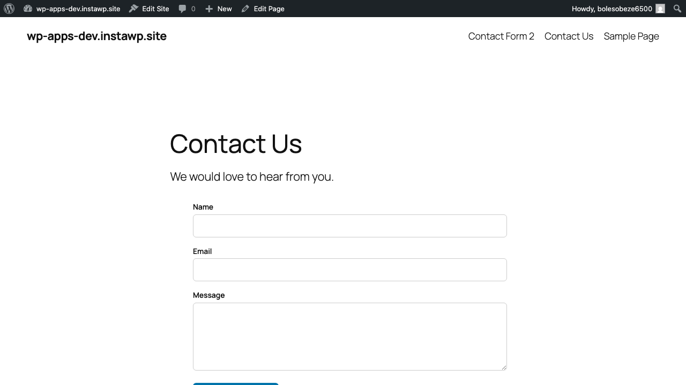
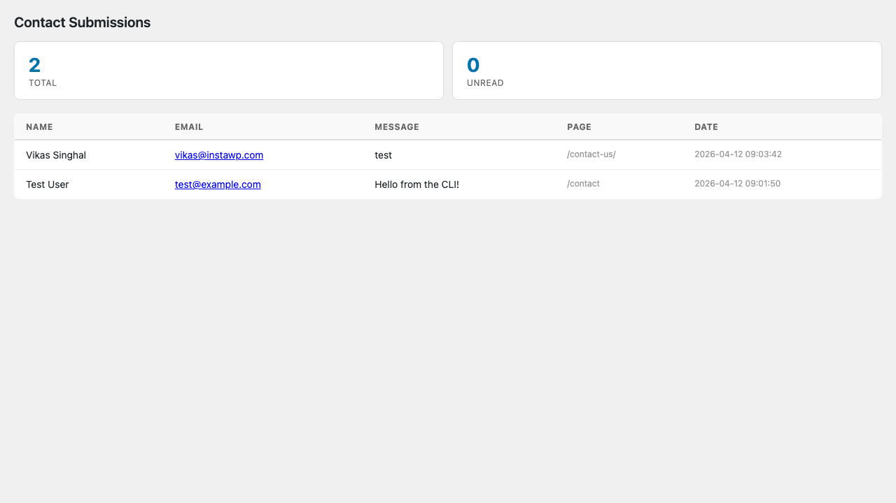

# WP Apps — Example Apps

Three example apps, from simplest to most complete. Each demonstrates different integration patterns.

## Hello App

The absolute minimum WP App. ~10 lines of logic.

```bash
cd hello-app && php -S localhost:8001 index.php
```

**What it does:** Logs when a post is saved (async event webhook).

**Patterns:** Event webhook only. No blocks, no UI, no storage. Just "hello, a post was saved."

**Files:** [`hello-app/`](hello-app/)

---

## Reading Time

The simplest *useful* app. ~50 lines of logic.

```bash
cd reading-time && php -S localhost:8003 index.php
```

**What it does:**
1. Event: `save_post` → counts words → writes `reading_time` and `word_count` to post meta
2. Block: displays a "X min read" badge (cached for 24hr)

**Patterns:** Event webhook → post meta → block (the complete data-first loop)

**Files:** [`reading-time/`](reading-time/)

---

## Contact Form

A full-featured app. ~150 lines of logic.

```bash
cd contact-form && php -S localhost:8002 index.php
```

**What it does:**
1. Block: renders a contact form (cached, zero page-load cost)
2. Form submissions POST to the app's `/submit` endpoint
3. App stores submissions in its own database (JSON file)
4. Admin panel at `/admin` shows all submissions

**Patterns:** Block (cached) + app endpoint + app-side storage + admin surface





**Files:** [`contact-form/`](contact-form/)

---

## Integration Patterns Summary

| Pattern | Page-load cost | When to use | Example |
|---------|:---:|---|---|
| Event webhook → post meta | Zero | React to content changes | Reading Time |
| Block (cached) | Zero after first render | Frontend UI | Contact Form, Reading Time |
| Shortcode fallback | Zero after first render | Elementor, Divi, Classic Editor | Contact Form |
| App-side storage | Zero | Submissions, subscribers, analytics | Contact Form |
| Admin surface (iframe) | Zero (admin only) | Dashboards, settings, data views | Contact Form |

## Running Locally

All examples use `localhost` endpoints in their manifests. To develop:

```bash
# 1. Pick an app and start it
cd reading-time && php -S localhost:8003 index.php

# 2. Install on your WordPress site
# WP Admin → Apps → Install New → http://localhost:8003/wp-app.json

# 3. The app is now connected. Save a post to trigger the event webhook.
```

For remote WordPress sites, expose your local server via a tunnel (ngrok, Cloudflare Tunnel, etc.) and update the `endpoint` in `wp-app.json` to the tunnel URL.
